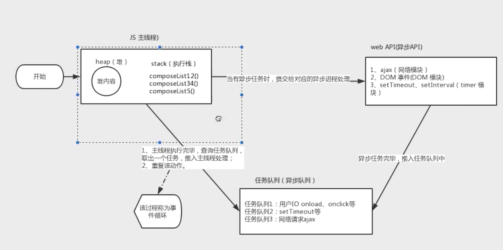

# 1、JS 是单线程

同一个时间只能做一件事情
js 的单线程，和它的用途有关，作为浏览器脚本语言，js 的主要用途是与用户互动，以及操作 dom，这决定它只能是单线程。

异步： 定时器 事件 请求 Promise ...

## JS 执行流程

1、主线程读取 js 代码，此时同步环境
2、主线程遇到异步任务，会推给异步线程处理
3、异步进行处理完毕，将异步任务推入任务队列
4、主线程查询任务队列，按照顺序执行微任务
5、微任务执行完毕，执行宏任务，取得第一个宏任务执行完毕
6、重复以上 4、5 步骤
