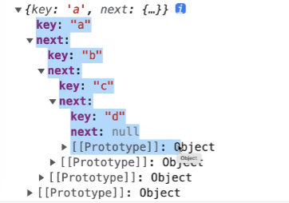
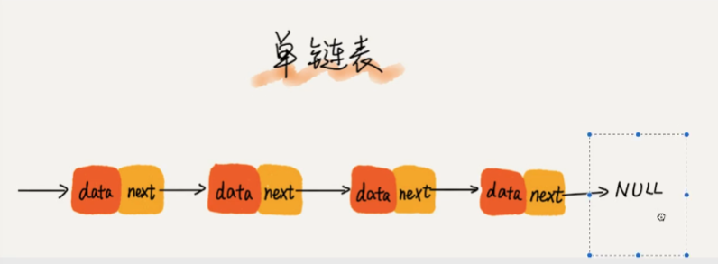
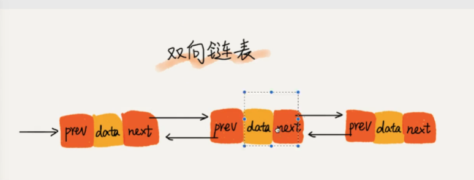
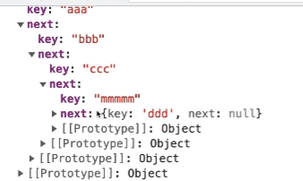
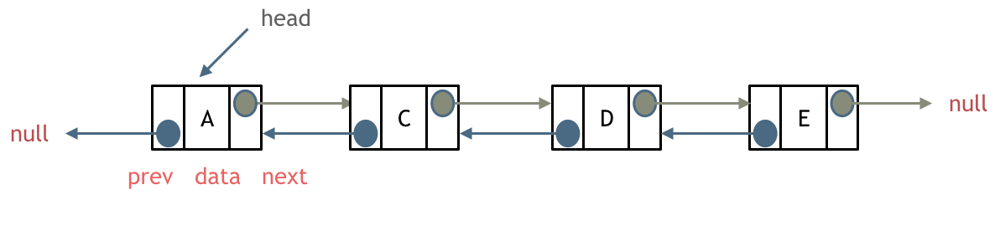
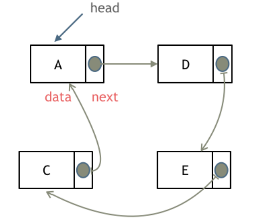

# 链表

多个元素存储的列表

链表的元素在内存中是通过 next 指针进行存储的，并不是像数组一样按照顺序存储

```js
let a = {key ： 'a'}
let b = {key ： 'b'}
let c = {key ： 'c'}
let d = {key ： 'd'}

a.next = b
b.next = c
c.next = d
d.next = null

console.log(a) // 打印有两个属性 一个是key 一个是next
```



# 原型链

js 中的原型链 原理 就是链表结构，只不过把 next 变成了 `__proto__`

# 链表和数组的区别

1、数组是有序存储的，在中间某个位置添加或者删除某个元素，其它元素的下标要跟着改变

2、链表不是按照顺序排序的，是通过 next 指针来存储

# 链表分类

单向链表
双向链表
等等

## 单项链表


单项链表 最后一定是 null

## 双向链表


双向链表比单向链表多一个属性 prev，表示上一个元素

# 链表遍历

```js

let a = {key ： 'a'}
let b = {key ： 'b'}
let c = {key ： 'c'}
let d = {key ： 'd'}

a.next = b
b.next = c
c.next = d
d.next = null

// 遍历链表
let obj = a
while (obj && obj.key) {
  console.log(obj.key)
  obj = obj.next
}

// 链表插入元素
let m = {key:'mmmm'}
c.next = m
m.next = d
console.log(a)

// 链表删除元素
c.next = d // 就直接删除了m
```



# instanceof 原理

```js
let arr = [1, 2, 3]
console.log(arr instanceof Object) // true
```

instanceof 是通过原型链 来判断目标元素的原型是否存在原型链上

```js
function customInstanceof(left, right) {
  // 获取对象的原型
  let proto = Object.getPrototypeOf(left)

  // 循环遍历对象的原型链
  while (proto) {
    // 检查当前对象的原型是否等于构造函数的 prototype 属性
    if (proto === right.prototype) {
      return true
    }
    // 继续向上遍历原型链
    proto = Object.getPrototypeOf(proto)
  }

  // 如果没有在原型链中找到构造函数的 prototype，返回 false
  return false
}
```

# 单链表

虚拟头节点

# 双链表



# 循环链表



# 性能分析


