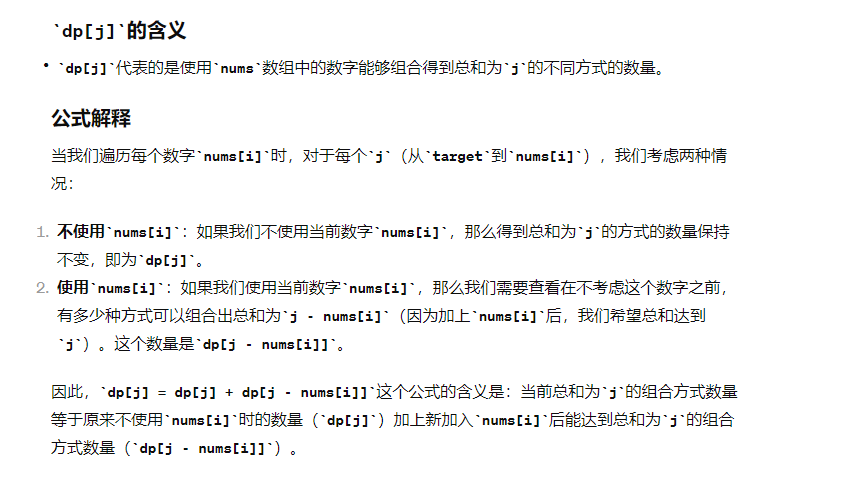
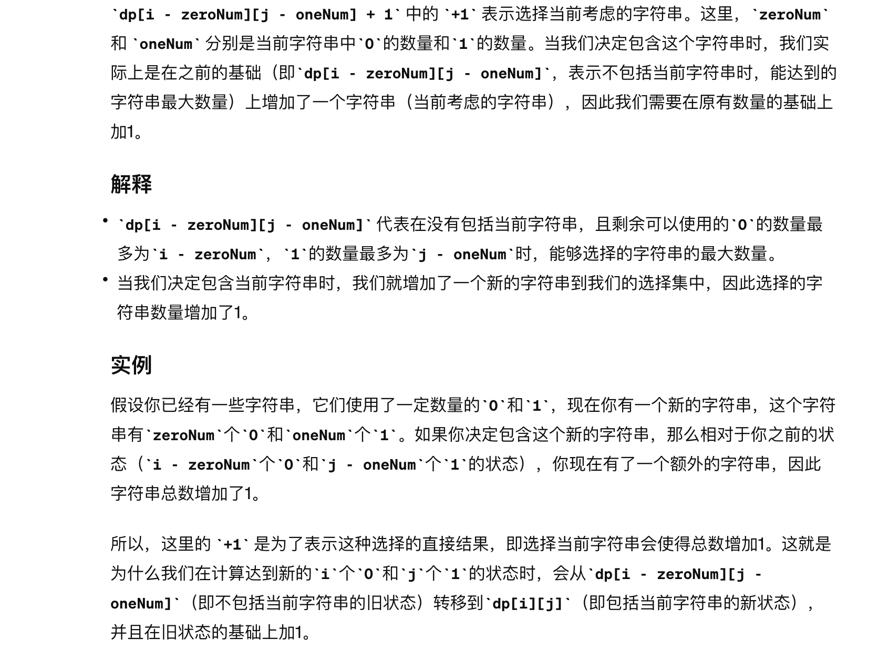

# 01 背包

例子： 有 n 种物品，每种物品只有一个

dp[i][j] 代表着 i 个物品总重量为 j 此时的最大价值

状态转移方程：
dp[i][j] = Math.max((value[i] + dp[i-1] [ j - weight[i]]), dp[i-1][j])

next[j] = Math.max(value[i] + result[j - weight[i]], result[j])

```js
// 滚动数组方式
function package(bagWeight, value, weight) {
  let result = []

  for (let i = 0; i <= bagWeight; i++) {
    result[i] = i >= weight[0] ? value[0] : 0
  }

  for (let i = 1; i < value.length; i++) {
    const next = []
    // j代表背包空间
    for (let j = 0; j <= bagWeight; j++) {
      if (j >= weight[i]) {
        next[j] = Math.max(value[i] + result[j - weight[i]], result[j])
      } else {
        next[j] = result[j]
      }
    }
    result = next
  }
  return result[bagWeight]
}

const res = package(6, [5, 10, 3, 6, 3], [2, 5, 1, 4, 3])
console.log(res, "res") // 13
```

求装满背包有几种方法的情况下，递推公式一般为：dp[j] = dp[j] + dp[j-nums[i]]。



471 题 1 和 0 递推公式意义
dp[i][j] = max(dp[i][j], dp[i - zeroNum][j - oneNum] + 1);
+1 是指 增加了一个字符串，代表采用当前字符串之后，所有的子集数量 需要增加一个，增加的这一个就是当前所采用的这个，因为 dp[i - zeroNum][j - oneNum]代表没采用之前所有的子集数量，所以 +1


# 完全背包

例子： 有 n 种物品，每种物品有无限个

如果求组合数就是外层 for 循环遍历物品，内层 for 遍历背包。

如果求排列数就是外层 for 遍历背包，内层 for 循环遍历物品。
