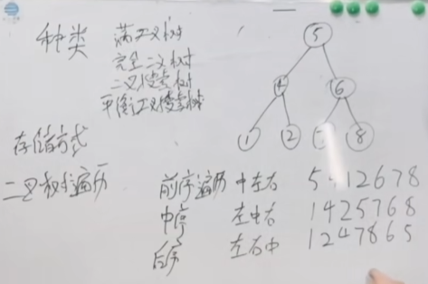

# 二叉树

## 满二叉树

节点数量 就是 2 的 k 次方 -1 k 是树的深度

## 完全二叉树

完全二叉树 就是在满二叉树的基础上 最底下一层 是从左到右连续的 也就是说 以满二叉树的视角去看 完全二叉树 底部有确实 满二叉树一定是完全二叉树 但是完全二叉树不一定是满二叉树

## 二叉搜索树 logn 级别

二叉搜索树 对树的结构 没有要求，但是元素顺序必须是按照从小到大的顺序排列的 从左到右

## 平衡二叉搜索树

左子树和右子树的高度差 不能超过 1

# 二叉树的存储方式

## 链式存储

## 线性存储

例： 比如给你一个数组的下标 你如何求左右子节点
左： 2*i+1
右： 2*i+2

# 二叉树的遍历

## 深度优先遍历（递归）

### 前序遍历

前序遍历的遍历方式：中左右

### 中序遍历

中序遍历的遍历方式：左中右

### 后序遍历

后序遍历的遍历方式：左右中

## 广度优先遍历

### 层序遍历
