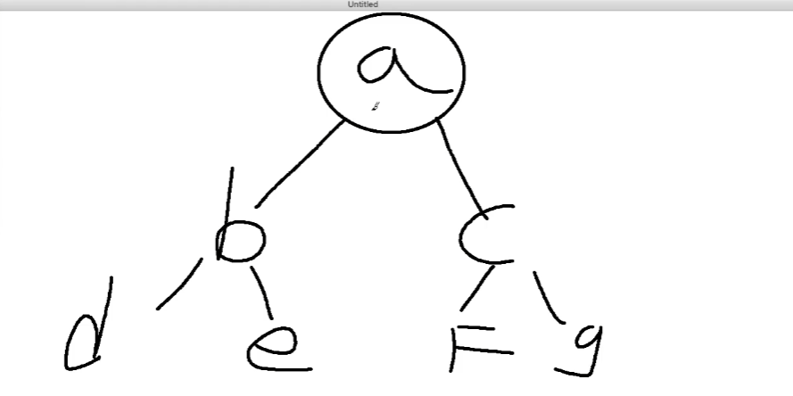
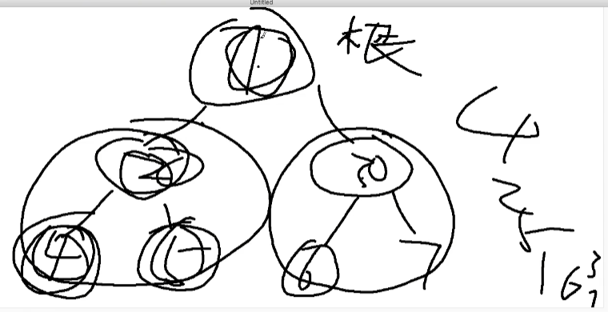

# 树

一种分成数据的抽象模型

# 深度优先遍历 和 广度优先遍历

```js
const tree = {
  val: "a",
  children: [
    {
      val: "b",
      children: [
        {
          val: "d",
          children: [],
        },
        {
          val: "e",
          children: [],
        },
      ],
    },
    {
      val: "c",
      children: [
        {
          val: "f",
          children: [],
        },
        {
          val: "g",
          children: [],
        },
      ],
    },
  ],
}
```



## 深度优先遍历

纵向 找到最低 再往上

从根节点出发，尽可能深的搜索树的节点

技巧：
1、访问根节点
2、对根节点的 children 挨个进行深度优先遍历

```js
const tree = {
  val: "a",
  children: [
    {
      val: "b",
      children: [
        {
          val: "d",
          children: [],
        },
        {
          val: "e",
          children: [],
        },
      ],
    },
    {
      val: "c",
      children: [
        {
          val: "f",
          children: [],
        },
        {
          val: "g",
          children: [],
        },
      ],
    },
  ],
}

// 深度优先遍历

const fun1 = (root) => {
  console.log(root.val)
  root.children.forEach(fun1)
}

fun1(tree) // a b d e c f g
```

## 广度优先遍历

横向 也就是队列 入队 出队

从根节点出发，优先访问离根节点最近的节点

技巧：
1、新建一个队列，把根节点入队
2、把队头出队 使用 shift 方法
3、把队头的 children 挨个入队
4、重复 2 和 3 步骤，直到队列为空为止

```js
const tree = {
  val: "a",
  children: [
    {
      val: "b",
      children: [
        {
          val: "d",
          children: [],
        },
        {
          val: "e",
          children: [],
        },
      ],
    },
    {
      val: "c",
      children: [
        {
          val: "f",
          children: [],
        },
        {
          val: "g",
          children: [],
        },
      ],
    },
  ],
}

// 广度优先遍历

const fun2 = (root) => {
  const arr = [root]

  while (arr.length > 0) {
    const o = arr.shift()
    console.log(o.val)
    o.children.forEach((item) => {
      arr.push(item)
    })
  }
}

fun2(tree) // a b c d e f g
```

# 多叉树

DOM 结构就是多叉树

一个节点下有 2 个以上的分叉

# 二叉树

```js
const tree = {
  val: "1",
  left:{
    val:'2',
    left:{
      val:'4',
      left:null,
      right:null
    },
    right:{
      val:'4'
      left:null,
      right:null
    },
  },
  right:{
    val:'3',
    left:{
      val:'6',
      left:null,
      right:null
    },
    right:{
      val:'7'
      left:null,
      right:null
    },
  }
}

```

# 二叉树的前序遍历 或者叫 二叉树的先序遍历

口诀：
根
左
右

```js
const tree = {
  val: "1",
  left: {
    val: "2",
    left: {
      val: "4",
      left: null,
      right: null,
    },
    right: {
      val: "5",
      left: null,
      right: null,
    },
  },
  right: {
    val: "3",
    left: {
      val: "6",
      left: null,
      right: null,
    },
    right: {
      val: "7",
      left: null,
      right: null,
    },
  },
}

var preorderTraversal = function (root) {
  let res = []

  const fun = (node) => {
    if (node) {
      // 先根节点
      res.push(node.val)

      // 遍历左子树
      fun(node.left)
      // 遍历右子树
      fun(node.right)
    }
  }
  fun(root)

  return res
}

console.log(preorderTraversal(tree)) // 打印结果 ["1", "2", "4", "5", "3", "6", "7"]
```

# 二叉树的中序遍历

左
根
右



```js
const tree = {
  val: "1",
  left: {
    val: "2",
    left: {
      val: "4",
      left: null,
      right: null,
    },
    right: {
      val: "5",
      left: null,
      right: null,
    },
  },
  right: {
    val: "3",
    left: {
      val: "6",
      left: null,
      right: null,
    },
    right: {
      val: "7",
      left: null,
      right: null,
    },
  },
}
// 递归版
var inorderTraversal = function (root) {
  const arr = []
  const fun = (root) => {
    if (!root) return

    // 找左子树
    fun(root.left)
    arr.push(root.val)
    fun(root.right)
  }
  fun(root)
  return arr
}

console.log(inorderTraversal(tree)) // 打印结果 ["1", "2", "4", "5", "3", "6", "7"]
```

# 二叉树的后序遍历
